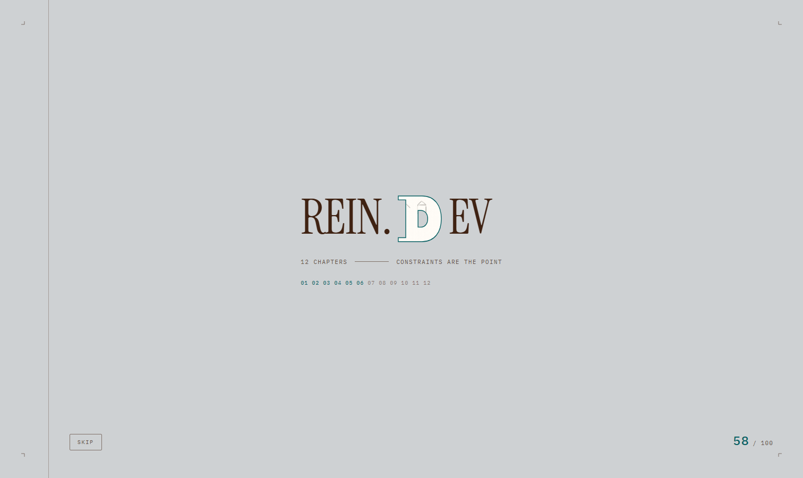
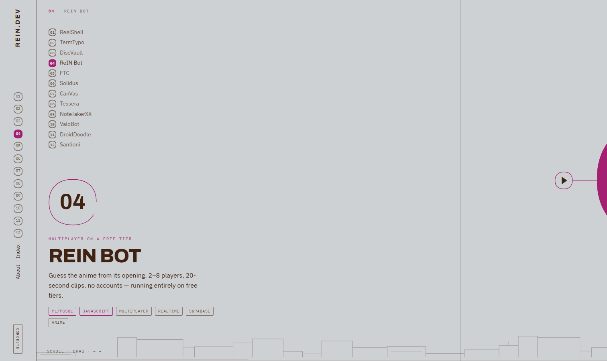
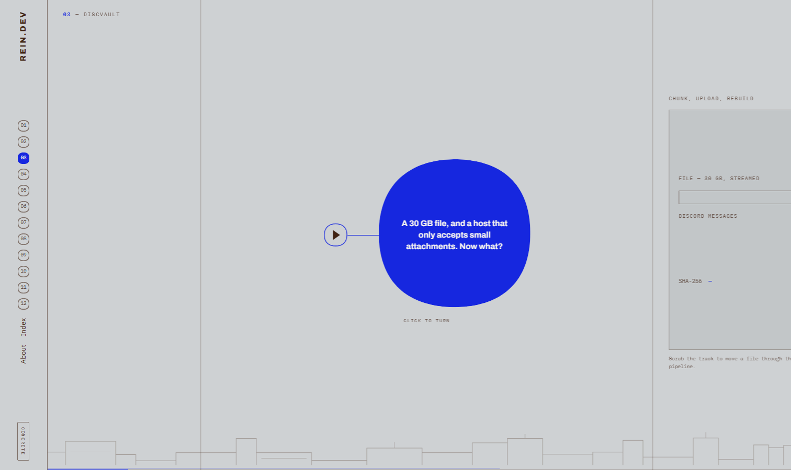
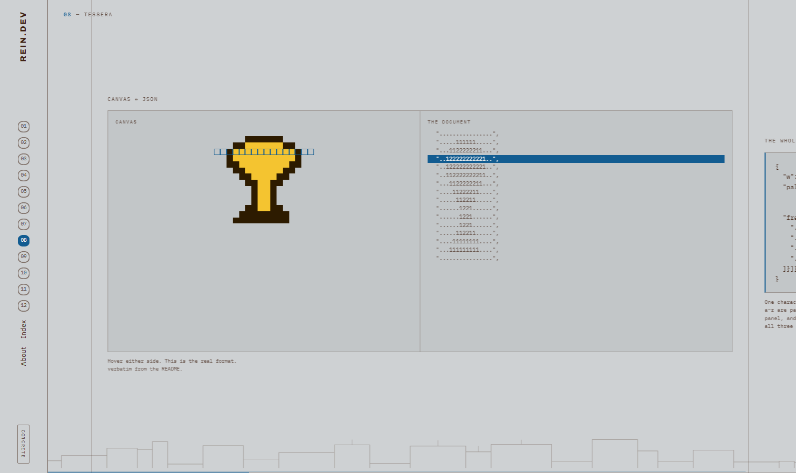
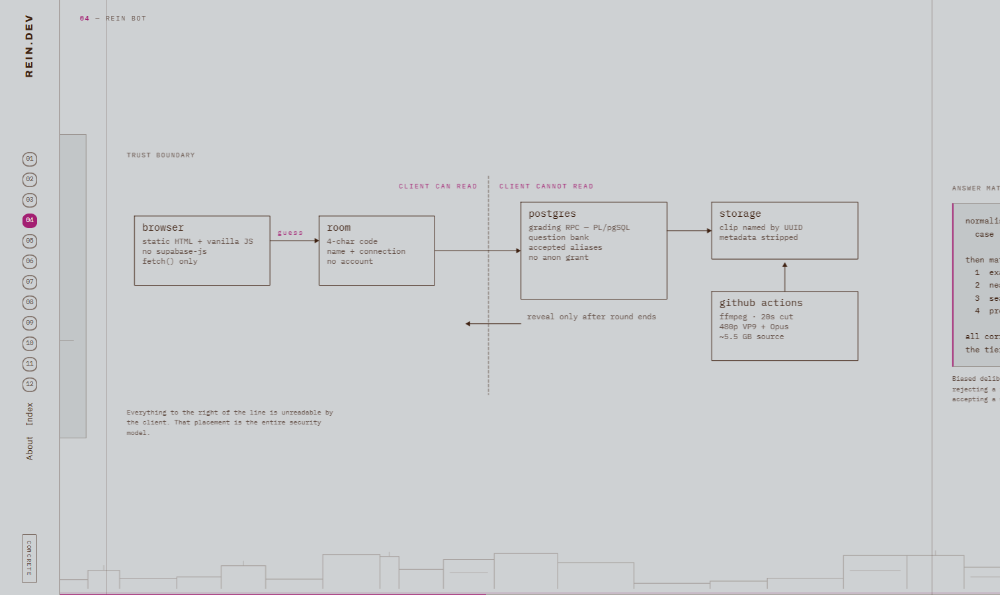
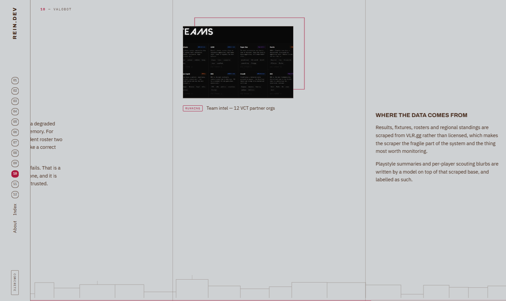
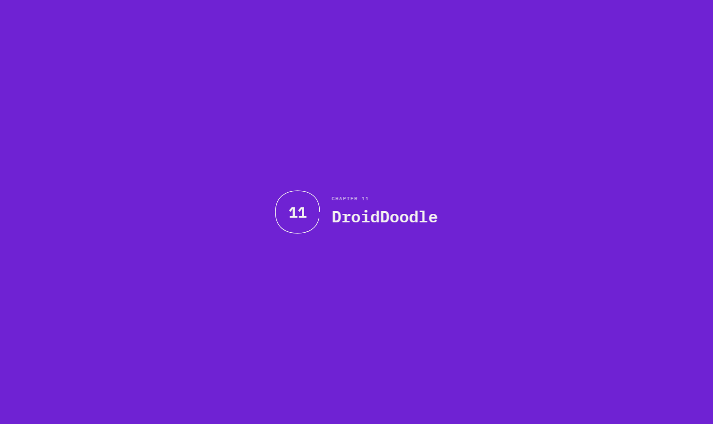
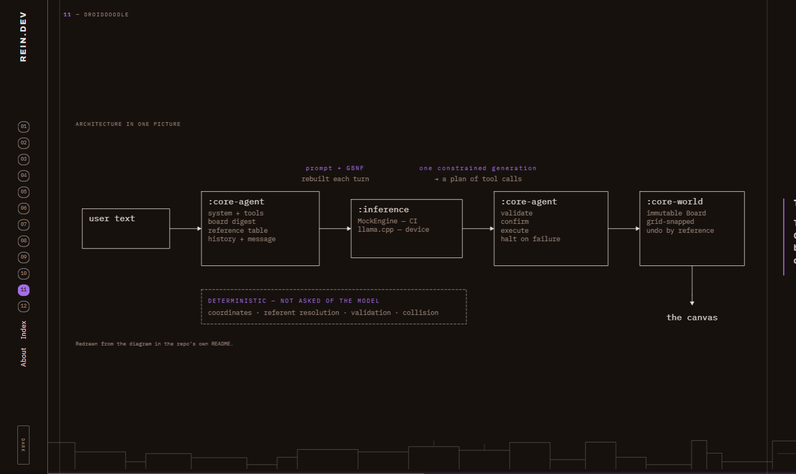
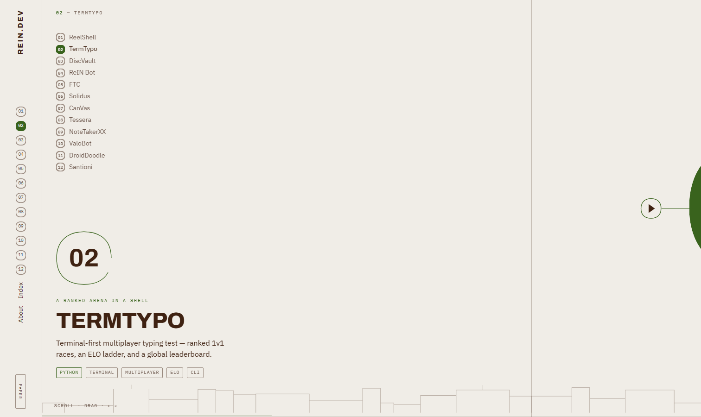

# rein.dev

A horizontally-scrolling portfolio in the manner of [ikony.tv](https://ikony.tv). Twelve chapters, one per repository, each arguing the same thing: **take a surface that is not supposed to do the job, and make it do the job anyway.** A terminal that streams video, a chat app's attachment cap used as a filesystem, a free tier running realtime multiplayer for eight people, a phone running the model itself.

No framework, no dependencies, no build tooling. `node build.mjs` writes a static `dist/`.

**Live:** [sayandeep1013.github.io/RepoLogs](https://sayandeep1013.github.io/RepoLogs/)

---

## Screenshots

| Intro loader — the D of .DEV is a window | Chapter title card |
|---|---|
|  |  |

| The constraint, as a question | A set piece — canvas ↔ JSON |
|---|---|
|  |  |

| Line-art architecture, drawn on scroll | Shaped screenshots and the frieze |
|---|---|
|  |  |

| Between-chapter loader | Dark theme |
|---|---|
|  |  |

| Paper theme |
|---|
|  |

---

## How it works

- **The page does not scroll — the track does.** `<html>` and `<body>` are `overflow:hidden` and locked to `100vh`. Vertical wheel delta is remapped to a horizontal target and eased toward it in `requestAnimationFrame`.
- **Damped, not animated.** `damping: 0.1` on wheel, `0.42` on touch so dragging feels direct. The easing is JS, not CSS.
- **The wheel is released at both edges**, so the page is never a trap — the one thing ikony.tv gets wrong.
- **Chapters are separate pages.** Real URLs, per-chapter loading, and a between-chapter loader that carries the incoming accent so the colour lands before the page does.
- **Every screenshot sits inside a shape** — blob, lens or slab — with an outlined ghost of that shape offset behind it, drawn on reveal. Nothing is full-bleed.
- **Accents are sampled from the work.** Each chapter's colour was extracted from that project's own screenshots, then corrected for contrast.

```js
target += e.deltaY                        // vertical wheel → horizontal target
cur    += (target - cur) * 0.1            // damped in rAF
track.style.transform = `translate3d(${-cur}px,0,0)`
```

---

## The twelve chapters

| # | Chapter | Repo | The constraint it breaks |
|---|---|---|---|
| 01 | ReelShell | [ReelShell](https://github.com/Sayandeep1013/ReelShell) | A terminal can be a streaming client |
| 02 | TermTypo | [TermTypo](https://github.com/Sayandeep1013/TermTypo) | A terminal can be a ranked competitive arena |
| 03 | DiscVault | [DiscVault](https://github.com/Sayandeep1013/DiscVault) | An attachment cap is a block size |
| 04 | ReIN Bot | [Rein-Bot](https://github.com/Sayandeep1013/Rein-Bot) | A free tier can host realtime multiplayer |
| 05 | FTC | [FTC-Game](https://github.com/Sayandeep1013/FTC-Game) | No client decides the outcome |
| 06 | Solidus | [Solidus-Bingo](https://github.com/Sayandeep1013/Solidus-Bingo) | A sideloaded app can still be updated |
| 07 | CanVas | [co-canvas](https://github.com/Sayandeep1013/co-canvas) | A URL is the whole account system |
| 08 | Tessera | [Tessera](https://github.com/Sayandeep1013/Tessera) | A drawing is a document an AI can edit |
| 09 | NoteTakerXX | [NoteTakerXx](https://github.com/Sayandeep1013/NoteTakerXx) | Notes have coordinates |
| 10 | ValoBot | [ValoBot](https://github.com/Sayandeep1013/ValoBot) | A model with no cutoff, if it fetches first |
| 11 | DroidDoodle | [DroidDoodle](https://github.com/Sayandeep1013/DroidDoodle) | A phone runs the model that drives the canvas |
| 12 | Santioni | [Martini-Recreation](https://github.com/Sayandeep1013/Martini-Recreation) | A closed WebGL system can be read |

Reading order lives in `ORDER` in `content/chapters.mjs`. Chapter numbers are derived from it, so re-sequencing is a one-line change and the labels can never drift.

---

## Anatomy of a chapter

Every chapter runs the same grammar, so you learn it once in 01 and read the rest fluently.

1. **Title card** — numeral in the irregular ring, chapter list, pitch, language chips
2. **The constraint** — the problem as a question in the accent blob; click to flip to the answer
3. **The set piece** — a bespoke interactive built for that project
4. **Architecture** — flat SVG line art that draws itself on
5. **The hard part** — prose, a code specimen, or measurements
6. **Evidence** — shaped screenshots, sliders
7. **Outcome** — live URL, package, repo
8. **Handoff** — the next chapter, accent already crossfading

### The set pieces

| # | Piece | What it does |
|---|---|---|
| 01 | `tui` | replays browse → search → season → provider fallback → mpv |
| 02 | `race` | two lanes, live WPM, ELO delta at the line |
| 03 | `chunks` | scroll-driven: a file splits, chunks land as messages, SHA-256 verifies |
| 04 | `round` | a 20s round — countdown, guesses graded, near-miss tier revealed |
| 05 | `trumps` | stat called, cards compared, pile taken |
| 06 | `bingo` | numbers drawn server-side, board marks, a line completes |
| 07 | `presence` | two cursors, a document filling and a canvas being drawn, one Yjs doc |
| 08 | `tessera` | canvas ↔ JSON — hover either side, the other highlights |
| 09 | `canvas` | notes placed on a dot grid, then linked with rope curves |
| 10 | `cypher` | two questions — the second fails to ground, and is refused |
| 11 | `agent` | a sentence in, tool calls stream, nodes snap onto the board |
| 12 | `shader` | a real WebGL fragment shader — the chapter is about shaders |

Set pieces are decorative. Nothing in them gates content, and each is wrapped so a failure cannot break the page.

---

## Design system

| Token | Value |
|---|---|
| Rail | `6vw`, min 64px — fixed |
| Column | `96px` → `118px` ≥1600 → `132px` ≥2050 |
| Ground | `#F0EDE7` paper · `#CED1D3` concrete · `#17110E` dark |
| Ink | `#3F2212` / `#E7DED6` |
| Hover | `#A34A00` paper · `#B85400` concrete · `#FF9A3D` dark |
| Easing | `cubic-bezier(.16,1,.3,1)` for everything that moves in space |
| Display | Archivo |
| Body | IBM Plex Sans |
| Mono | IBM Plex Mono |
| Loader wordmark | Instrument Serif |

### Accent pairs

Sampled from each project's own screenshots, then corrected for contrast. A single hex cannot clear 4.5:1 against both a light and a dark ground, so every chapter carries a pair.

| # | Chapter | Light | Dark |
|---|---|---|---|
| 01 | ReelShell | `#086063` | `#12A5AA` |
| 02 | TermTypo | `#39631D` | `#5C9C32` |
| 03 | DiscVault | `#1627DF` | `#747EF1` |
| 04 | ReIN Bot | `#A31F72` | `#DE54AB` |
| 05 | FTC | `#7F4F0A` | `#C67A10` |
| 06 | Solidus | `#106534` | `#1BA755` |
| 07 | CanVas | `#973911` | `#E75D23` |
| 08 | Tessera | `#125C91` | `#2595E4` |
| 09 | NoteTakerXX | `#6A570C` | `#A58812` |
| 10 | ValoBot | `#AB1C40` | `#E4587B` |
| 11 | DroidDoodle | `#6F22D3` | `#A36EE7` |
| 12 | Santioni | `#B8241F` | `#E25F5A` |

---

## Loaders and line work

The **intro loader** wears the site's own clothes — the same ground, ink and hairlines, with the accent used as an accent — so arriving at chapter 01 is a continuation rather than a cut. The wordmark is the one place a display serif appears (Instrument Serif): a title page, not a splash screen. The **D of .DEV is a window** — a slab-serif letterform set as a versal, larger than the cap height, with project screenshots cycling inside it, clipped to its outline. Registration marks draw in at the corners, a counter and a row of chapter ticks show real preload progress. Once per session, skippable by any input.

The **between-chapter loader** carries the incoming chapter's number, title and accent, so the colour lands before the page does. Its ring draws itself on with the same gesture as the arrow ring at the end of a chapter, then the numeral and title rise. It is handed across the navigation in `sessionStorage` and stamped into its covering state *before first paint* — so it is never seen sliding in twice, and the ring never draws twice.

- **The frieze** — a technical elevation along the base of every track, generated deterministically from the chapter slug and drawn progressively by scroll position.
- **Diagrams** draw themselves on with `stroke-dashoffset`, staggered per path.
- **Rings and leaders** — the big numeral, every icon button, the line into the constraint blob — draw in on reveal.
- **Ghost outlines** behind every screenshot: the drawing and the photograph of the same object, the way a monograph plates them.

---

## Stack

| Layer | Technology |
| --- | --- |
| Generator | Node 18+, plain ESM — no framework, no dependencies |
| Templating | Tagged template literals in `build.mjs` |
| Styling | One hand-written stylesheet, CSS custom properties for theming |
| Runtime | Two vanilla scripts — `engine.js` (scroll, loaders, reveals), `chapters.js` (set pieces) |
| Graphics | Inline SVG line art, one `clip-path` polygon, one WebGL fragment shader |
| Images | WebP, converted and resized from each project's own screenshots |
| Hosting | GitHub Pages via GitHub Actions |

---

## Project structure

```txt
build.mjs               static generator — writes dist/
serve.mjs               local preview server
content/
  chapters.mjs          chapters 01–08, ORDER, the derived export
  chapters-b.mjs        FTC, Solidus, NoteTakerXX, ValoBot
  diagrams.mjs          twelve line-art diagrams (a small SVG DSL)
  shapes.mjs            rings, icon buttons, the D-window, crop marks, the frieze
  blob.txt              the clip-path polygon, 159 points
assets/
  css/site.css          the whole design system
  js/engine.js          loaders, scroll, transitions, reveals, draw-on
  js/chapters.js        the twelve set pieces
  img/*.webp            screenshots pulled from each project
screenshots/readme/     the images in this file
.github/workflows/      Pages build and deploy
```

Adding a chapter is one entry in `chapters-b.mjs`, one slug in `ORDER`, and a diagram.

---

## Local setup

```bash
node build.mjs     # → dist/
node serve.mjs     # → http://127.0.0.1:4321
```

To build for a project-site subpath, the way GitHub Pages serves it:

```bash
BASE=/RepoLogs node build.mjs
```

---

## Accessibility

Arrow keys, PageUp/PageDown, Home and End drive the track; `→` at the end advances the chapter. All text clears WCAG AA on all three themes — body 9.45:1 on concrete, 14.09:1 on dark, smallest label 4.61:1. Focus is visible throughout.

`prefers-reduced-motion` sets damping to `1.0` (instant), holds diagrams fully drawn, and reduces both loaders to a fade. It does **not** fall back to a vertical layout, because the horizontal structure is the content rather than the animation.

---

## Notes

- **The blob.** One `clip-path: polygon()` traced from a hand-drawn circle, decimated from 1,268 points to 159, defined once and reused for every masked element. Nothing on the site is a perfect circle.
- **Draw-on diagrams.** The strokes use `vector-effect:non-scaling-stroke`, which makes the browser apply `stroke-dasharray` in *rendered* pixels while `getBBox`/`getTotalLength` report *user* units. The dash length is scaled by the viewBox→screen ratio; without that, one edge of every box stays undrawn.
- **Images are eager.** `loading="lazy"` does not fire reliably inside a transform-driven track — the browser never sees the images enter the viewport.
- **The shader holds its last frame while the track is moving.** Nobody reads a texture flying past, and those milliseconds are worth more to the scroll. It also drops octaves and resolution if it detects sustained slow frames.

## Licence

MIT for the code. Screenshots and copy describe projects owned by [@Sayandeep1013](https://github.com/Sayandeep1013).
